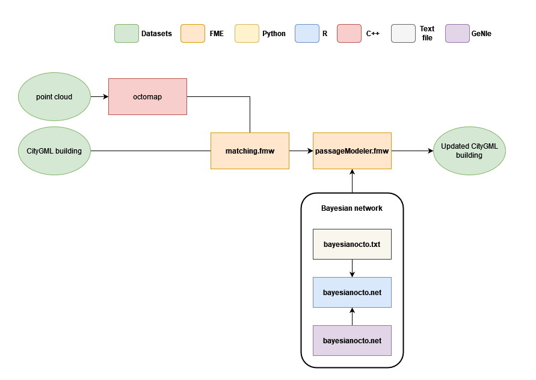

# conflict-mls-citygml-detection

## Implementation overview

The implementation of the presented methodology consists of several tools:
- The coregistration and matching parts are implemented in [FME 2020.1](https://docs.safe.com/fme/html/FME_Desktop_Documentation/FME_Workbench/Workbench/About%20FME%20Workbench.htm)
- Within the FME workspace coregistration.fmw Python 3.7 scripts and libraries [Open3D](http://www.open3d.org/) and [Pyntcloud](https://github.com/daavoo/pyntcloud) are integrated
- The inference of the Bayesian network is performed in [R](https://www.r-project.org/) using the [bnspatial](https://cran.r-project.org/web/packages/bnspatial/bnspatial.pdf) package.
- The network can is designed in [GeNIe](https://download.bayesfusion.com/files.html?category=Academia) but one can use similar software (see [Stritih et al., 2020](https://www.sciencedirect.com/science/article/pii/S1364815219306061) for a nice overview)

    

